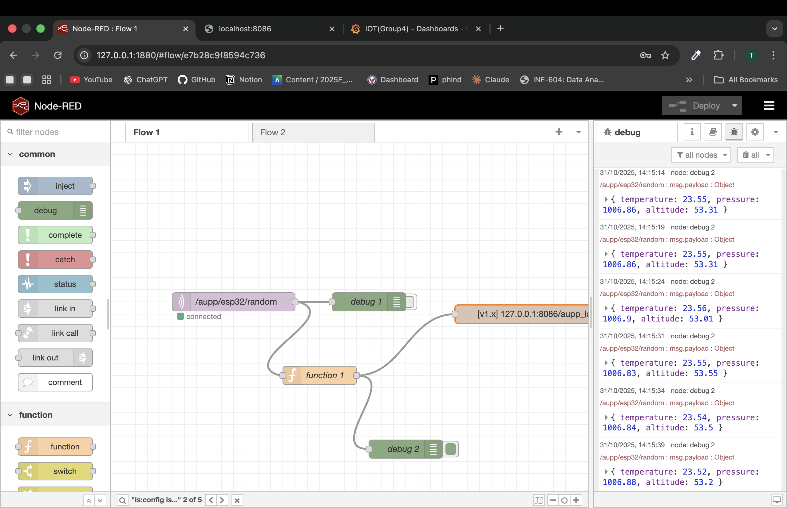
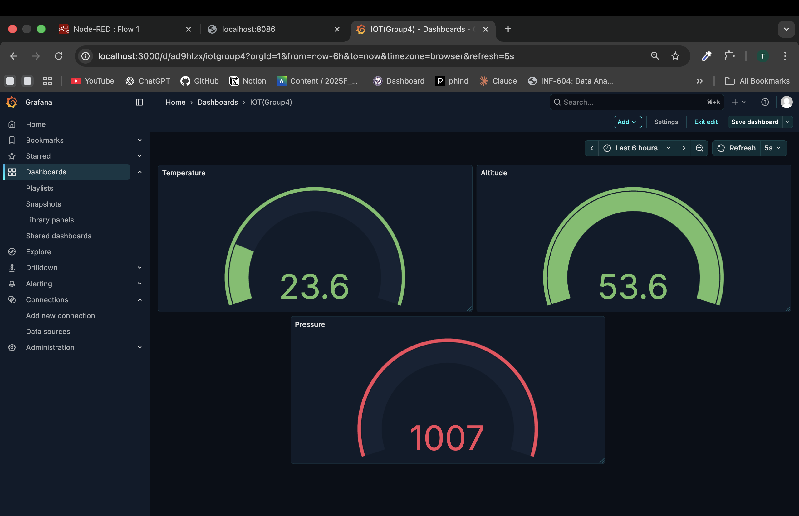

# 🌐 IoT Data Pipeline: ESP32 → MQTT → Node-RED → InfluxDB → Grafana

This project demonstrates a complete **IoT data monitoring system** using an **ESP32** running **MicroPython**, which sends random sensor data through **MQTT**, processed in **Node-RED**, stored in **InfluxDB**, and visualized on a live **Grafana Dashboard**.

---

## 🧭 Project Flow

**ESP32 → MQTT Broker → Node-RED → InfluxDB → Grafana**

| Component | Purpose | Image |
|------------|----------|-------|
| **ESP32 (MicroPython)** | Sends random sensor data every few seconds |  |
| **MQTT (Mosquitto)** | Transfers data between ESP32 and Node-RED |  |
| **Node-RED** | Processes and forwards data to InfluxDB |  |
| **InfluxDB** | Stores time-series data from Node-RED | ! |
| **Grafana** | Displays real-time charts and analytics |  |

---

## ⚙️ Architecture Diagram

```mermaid
graph LR
A[ESP32] -->|Publishes Data| B((MQTT Broker))
B --> C[Node-RED Flow]
C --> D[(InfluxDB Database)]
D --> E[Grafana Dashboard]
