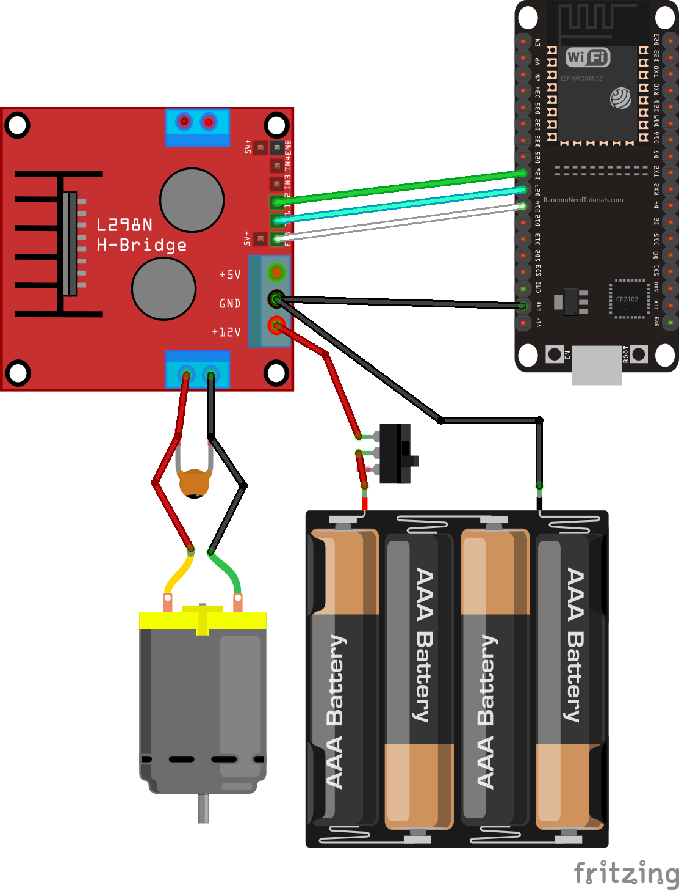
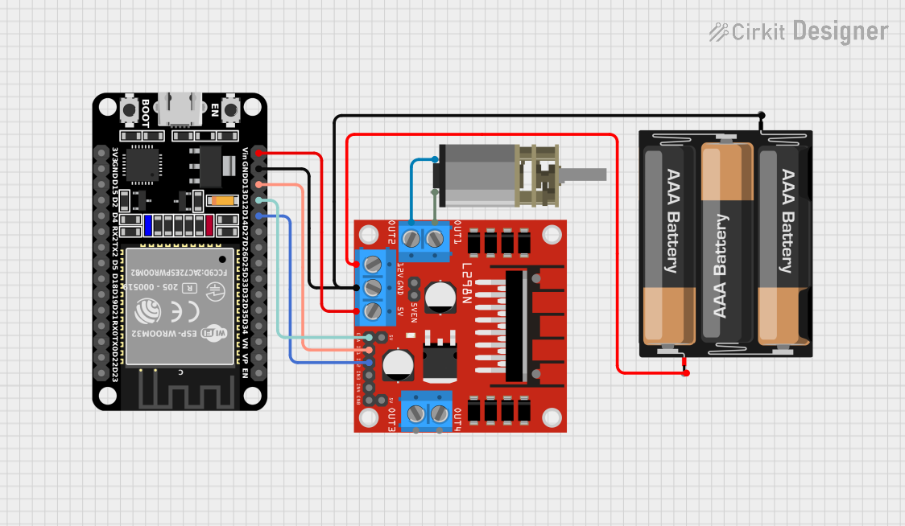

# LAB 5 – Mobile App DC Motor Control with Grafana

This project demonstrates remote control of a DC motor using an Android mobile application (MIT App Inventor) and an ESP32 web server. All motor actions are logged into InfluxDB and visualized on a Grafana dashboard.

---

## Features

### Mobile App Control
- Forward / Backward / Stop buttons  
- Speed slider (0–100%)

### ESP32 + L298N Motor Driver
- HTTP endpoints for motor commands  
- PWM-based speed control  
- Accessible from both MIT App and web browser

### IoT Data Logging
- Logs direction, speed, and timestamp to InfluxDB  
- Supports HTTP posting via Node-RED or direct API

### Grafana Dashboard
- Real-time motor speed graph  
- Command/event history table  
- Last motor action widget  

---

## Tech Stack

- **Hardware:** ESP32, L298N motor driver, DC motor, external power supply  
- **Firmware:** MicroPython (`main.py`)  
- **Mobile App:** MIT App Inventor (`.aia` file)  
- **Backend:** InfluxDB (via HTTP API / Node-RED)  
- **Dashboard:** Grafana  

---

# Demo Videos  
Click on any video thumbnail below to watch the demo.

### **Video 1 – Mobile App DC Motor Control**  

---

### **Video 2 – ESP32 + Grafana Full Demonstration**  

---

## Quick Start Guide

### 1. ESP32 Setup
1. Flash MicroPython firmware  
2. Upload `main.py`  
3. Update configurations inside the code:
   - Wi-Fi SSID & password  
   - InfluxDB/Node-RED HTTP endpoint  
   - Motor control pins  

### 2. Mobile App Setup
1. Import the `.aia` file into MIT App Inventor  
2. Set the ESP32 base URL:

---
## Grafana Dashboard Example  

## Wiring Diagram

